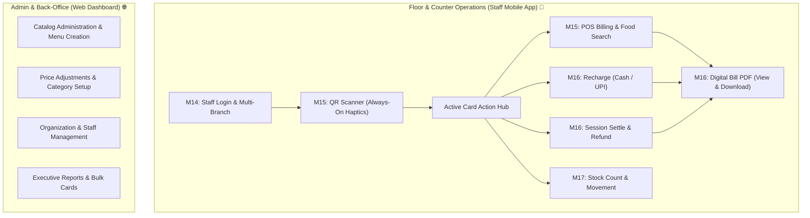

# 📱 Money Card — Flutter Staff Native App Roadmap

> **Target Platform**: Android (Physical Device & Scanner Terminal) & Cross-Platform Engine  
> **Status**: Milestones M13–M17 **COMPLETED ✅** | Milestones M18–M19 **UPCOMING ⏳**  
> **System Contract**: M0 V10 Frozen Shared System Specification  
> **Last Updated**: August 2026

---

## 🧭 Executive Architecture & System Boundary

The **Flutter Staff App** is custom-engineered specifically for **handheld cafeteria counter staff and floor operators**.



> [!IMPORTANT]
> **Strict Operational Boundary**:
> - **Web Dashboard**: Responsible for **Menu Creation, Product Price Editing, and Organization Management**.
> - **Flutter Staff App**: Responsible for **Fast Counter Billing, Hardware QR Scanning, Card Recharges, Balance Refunds, and Digital Bill PDF Generation/Download**. Product catalog creation is intentionally excluded from the staff phone.
> - **Receipt Delivery**: Standardized on **in-app Digital PDF Generation & Device Download** (`DigitalReceiptService`). Physical thermal printer hardware is not required.

---

## 📊 Milestone Status Summary

| Milestone | Scope & Domain | Key Deliverables | Status |
| :--- | :--- | :--- | :---: |
| **M13** | **Foundation & Design System** | Riverpod 2.6, Emerald Fintech M3 theme, Dio client pipeline, GoRouter navigation | `COMPLETED` ✅ |
| **M14** | **Staff Authentication & RBAC** | JWT Auth with auto-refresh, Branch selector, `AppPermission` role guards, Dev accounts | `COMPLETED` ✅ |
| **M15** | **QR Scanner & POS Billing** | Continuous QR scanner with always-on haptic vibration, Food Search + Category filters, Cart engine | `COMPLETED` ✅ |
| **M16** | **Payments, Refunds & Bill PDF** | Cash & UPI recharges, Card settlements, Unified `%PDF-` Bill builder, Android download pipeline | `COMPLETED` ✅ |
| **M17** | **Inventory & Shift Analytics** | Live stock list, Stock adjustments with audit reason logs, Shift revenue metrics & leaderboards | `COMPLETED` ✅ |
| **Mock Engine** | **Offline Standalone DB** | In-memory persistent database across app reboots, 100% offline execution, 1-tap data reset | `COMPLETED` ✅ |
| **M18** | **Real Backend Integration** | Connect to PostgreSQL `/api/v1` backend by switching `API_MODE=real` | `UPCOMING` ⏳ |
| **M19** | **Release & Production** | AAB Android signing, Proguard rule optimization, Play Store deployment | `UPCOMING` ⏳ |

---

## 🛠️ Detailed Completed Milestones (M13 — M17)

### 🔹 M13: Flutter Foundation & Design Architecture `[COMPLETED ✅]`
- **Tech Stack**: Flutter 3.38+ with Dart 3.10+.
- **State Management**: Riverpod 2.6 (`StateNotifierProvider`, `FutureProvider`, immutable state models).
- **Design System**: Emerald Fintech Material 3 Theme (`AppColors.primary`, custom typography, responsive cards & badges).
- **Network Pipeline**: Centralized `DioClient` with interceptor pipeline (`AuthInterceptor`, `ErrorInterceptor`, `LoggingInterceptor`).
- **Token Security**: Secure token storage abstraction with automatic in-memory fallback for testing.

---

### 🔹 M14: Staff Authentication & Multi-Branch RBAC `[COMPLETED ✅]`
- **JWT Lifecycle**: Access token + refresh token handling with transparent auto-renewal on 401.
- **Branch Selector**: Staff assigned to multiple branches can seamlessly toggle active branch context.
- **Permission Checker**: Fine-grained `AppPermission` evaluations (`purchase`, `recharge`, `cardReturn`, `inventoryAdjust`, etc.).
- **Developer Accelerators**: 1-Tap Dev Accounts (*Alex Morgan - Full Staff*, *Sam - Limited Cashier*).

---

### 🔹 M15: QR Scanner & POS Billing Search Engine `[COMPLETED ✅]`
- **Hardware QR Scanner**:
  - Continuous camera detection with autofocus and flashlight toggle.
  - **Always-On Vibration Feedback**: Short haptic feedback on detection (toggle removed from UI per specification).
  - Anti-spam scanner lock preventing duplicate scans while processing.
- **Active Card Action Hub**:
  - Resolves QR tokens to Card and Active Session in < 50ms.
  - Quick action tiles: `[ Add Products / POS Billing ]`, `[ Recharge Card ]`, `[ Settle & Return Card ]`, `[ Session Details ]`.
- **Searchable POS Food Catalog**:
  - Prominent top search bar with placeholder `"Search food or products"`.
  - Real-time search across food names and searchable catalog text.
  - Combined Search + Multi-Category Filters (*Veg, Non-Veg, Vegan, Breakfast, Lunch, Dinner, Snacks, Beverages*).
  - Selected cart items persist across search query and category filter changes.
  - Friendly no-results state (`"No products found"`) without error banners.
  - Quantity steppers (`[ - ] [ 2 ] [ + ]`) and instant total charge calculation.

---

### 🔹 M16: Payments, Refunds & Hardened Bill PDF Pipeline `[COMPLETED ✅]`
- **Recharge Workflows**:
  - **Cash Recharge**: Immediate card balance credit with receipt generation.
  - **Store Counter UPI**: Staff manual verification with optional UPI Reference/UTR capture.
- **Card Settlement & Refund**:
  - Authoritative remaining balance calculation, card return, and session closure.
- **Single Source of Truth PDF Builder (`DigitalReceiptService.buildBillPdf`)**:
  - Generates authentic 80mm thermal receipt PDFs with valid `%PDF-` binary signature (5,800+ bytes).
  - Specialized layouts for **Sales Receipts** (itemized table, total, remaining balance) and **Recharge Receipts** (recharge amount, payment method, UPI ref, previous/new balance).
- **Exact 3-Button Screen/Dialog UI**:
  1. `[ Generate & View PDF ]` — In-memory rendering using `PdfPreview`.
  2. `[ Download PDF ]` — Local Android file writing + native system Document Chooser (`Printing.sharePdf`).
  3. `[ Done ]` — Closes screen and resets cashier workflow.

---

### 🔹 M17: Inventory Movement & Shift Analytics `[COMPLETED ✅]`
- **Live Inventory Browser**: Real-time stock counts with `IN_STOCK`, `LOW_STOCK`, `OUT_OF_STOCK` badges.
- **Stock Adjustment**: Modal for stock replenishment or wastage with mandatory audit reason logging.
- **Shift Performance**: Revenue metric cards, active session counts, and product demand leaderboard (completely free of transaction limits or artificial quotas).

---

### 🔹 Standalone Offline Mock Engine `[COMPLETED ✅]`
- **100% Offline Resilience**: Full in-memory stateful mock API interceptor allowing complete end-to-end testing of POS, recharges, refunds, and PDF generation without active network access.
- **Dev Tools**: "Reset Mock Data" and "View Mock QR Tokens" in More screen.

---

## 🚀 Upcoming Roadmap: Phase 4 (M18 — M19)

```
┌────────────────────────────────────────────────────────┐
│ M18: Real /api/v1 Backend Integration (Switch API_MODE) │
└───────────────────────────┬────────────────────────────┘
                            │
┌───────────────────────────▼────────────────────────────┐
│ M19: Production Release, AAB Signing & CI/CD Pipeline   │
│  • Android App Bundle (AAB) Signing & Keystore Setup   │
│  • Proguard Obfuscation & App Size Optimization (<15MB)│
│  • Production Staging QA & Google Play Deployment       │
└────────────────────────────────────────────────────────┘
```

---

### 📋 M18: Real API Integration `[ESTIMATED: 1-2 WEEKS]`
- Toggle `AppConfig.apiMode` to `ApiMode.real`.
- Connect to Dev 2's PostgreSQL backend (`/api/v1/auth`, `/api/v1/cards`, `/api/v1/sessions`, `/api/v1/pos`, `/api/v1/recharge`, `/api/v1/inventory`).
- Validate end-to-end network latency and token expiry handlers in production staging.

---

### 📋 M19: Production Release & Google Play Deployment `[ESTIMATED: 1 WEEK]`
- Keystore generation and secure gradle release signing.
- Proguard and R8 shrinkage rules for clean binary size (< 15MB APK).
- CI/CD automated test pipeline and deployment artifact publishing to Google Play Store.

---

## 🧪 Current Verification & Quality Assurance Metrics

- **Unit & Widget Tests**: **135/135 tests passing green (100%)**.
- **Static Analysis**: `dart analyze .` passes with **0 errors, 0 warnings**.
- **Android Compatibility**: Verified on standard Android screen dimensions (360×800 to 412×915 dp) with zero horizontal overflow.
